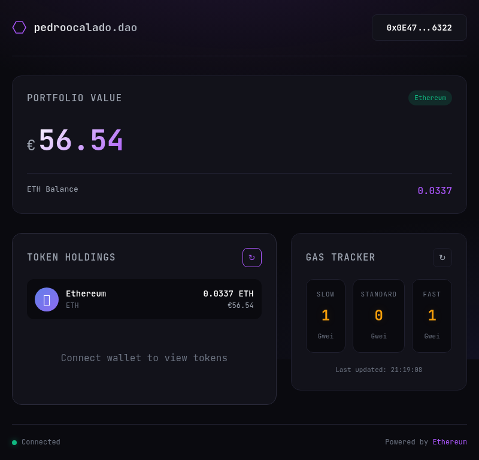

# pedroocalado.dao | DeFi Dashboard

A Web3 portfolio dashboard for tracking Ethereum holdings, gas prices, and DeFi positions.



## Features

- **Wallet Connection** - Connect MetaMask to view your ETH balance
- **Portfolio Tracking** - See your total ETH value in EUR
- **Gas Tracker** - Live Ethereum gas prices (Slow/Standard/Fast)
- **Responsive Design** - Works on desktop and mobile
- **Dark Theme** - Modern DeFi aesthetic

## Tech Stack

- **Frontend**: Vanilla HTML, CSS, JavaScript
- **Blockchain**: [viem](https://viem.sh) - Lightweight Ethereum library
- **Data**: CoinGecko API (prices), Ethereum RPC (balance/gas)
- **Testing**: Puppeteer (browser automation)

## Getting Started

### Local Development

```bash
cd pedroocalado.dao

# Start local server
python3 -m http.server 3000

# Open in browser
http://localhost:3000
```

### Connect Wallet

1. Install [MetaMask](https://metamask.io/)
2. Click "Connect Wallet"
3. Approve in MetaMask

## Automation Testing

Run automated browser tests:

```bash
cd /tmp
node /home/pedroocalado/pedroocalado.dao/automation.cjs
```

## Roadmap

### Phase 1: Core Features (Done ✅)
- [x] Wallet connection (MetaMask)
- [x] ETH balance display
- [x] EUR portfolio value
- [x] Gas tracker
- [x] Dark theme UI

### Phase 2: Enhanced Features (In Progress 🚧)
- [ ] ERC-20 token balances
- [ ] Multiple network support (Polygon, Arbitrum, etc.)
- [ ] Price charts (7d history)
- [ ] Transaction history
- [ ] Gas alerts

### Phase 3: DeFi Integration
- [ ] Aave positions
- [ ] Uniswap LP tokens
- [ ] Staking rewards
- [ ] Yield analytics

### Phase 4: Advanced Features
- [ ] Multi-wallet support
- [ ] Portfolio analytics
- [ ] Export to CSV
- [ ] Price alerts
- [ ] PWA support

## Deployment

### GitHub Pages (Current)
- Repository: [github.com/SilentCaMXMF/pedroocalado-dao](https://github.com/SilentCaMXMF/pedroocalado-dao)
- Live URL: [https://silentcamxmf.github.io/pedroocalado-dao/](https://silentcamxmf.github.io/pedroocalado-dao/)

### Custom Domain
Point `pedroocalado.dao` to the deployment URL via [Unstoppable Domains](https://ud.me).

## Project Structure

```
pedroocalado.dao/
├── index.html          # Main dashboard (self-contained)
├── automation.cjs      # Puppeteer test script
├── SPEC.md            # Project specification
├── fleek.json         # Fleek config
├── .github/
│   └── workflows/
│       └── deploy.yml # GitHub Pages deployment
└── src/
    ├── main.js        # JavaScript logic
    └── style.css      # Styles
```

## License

MIT

---

**Built with** ⛓️ **by pedroocalado.dao**
